# ai-dualstack

**A 12-week AI Practitioner Playbook – from consumer to self-hosted solution**

> *From infrastructure to AI application development and RAG pipeline integration, modularised for week-by-week learning and future-proof skills development.*
>
> GOAL: Build, optimise, and master my own dual-AI system — a <kbd>private</kbd> “Second Brain” & <kbd>public</kbd> AI deployment — using Proxmox, GPU passthrough, Ollama, Qwen, Mistral, vector databases, and a robust dev stack.  
>  

## Table of Contents

- [Overview](#overview) & [Architecture](#architecture-key-components)
- [Getting Started](#getting-started-custom-hardware-build)
- [Project Roadmap](#proposed-implementation-steps--milestones)
- [Contributing](#contributing)
- [License](#license)

---

## Overview
Project Goal: Stand up a highly optimised, secure, and extensible local AI platform for private knowledge management and public-facing applications.

## **Architecture Stack**
> Architecture highlights: GPU passthrough, RAG pipelines, full-stack monitoring, and modular security.

```mermaid
---
title: Logical Architecture Stack
config:
    displayMode: compact
    look: neo
    theme: dark
    themeVariables:
        fontFamily:	Courier New, monospace, Lucida Console, monospace;
        fontSize: 16;
    layout: dagre
---
flowchart TB
    %% === USERS ===
    subgraph Users["User Layer"]
        direction TB
        U1["Computing Devices"]
        U2["Personal Devices"]
        U3["Web Browsers"]
    end

    %% === UI LAYER ===
    subgraph UI["User Interface Layer"]
        direction TB
        UI1["Web & Mobile Apps"]
        UI2["Development IDEs"]
        UI3["SSH/VPN"]
    end

    %% === APPLICATION LAYER ===
    subgraph APPS["Application Layer"]
        subgraph PrivateApp["Private Environment"]
            direction TB
            P1["PrivateGPT"]
            P2["Personal AI Assistant"]
            P3["Document Analysis"]
        end

        subgraph PublicApp["Public Environment"]
            direction TB
            PU1["Agentic ChatBot"]
            PU2["Multi-tenant Platform"]
            PU3["POC Applications"]
        end
    end

    %% === COMPUTE ===
    subgraph Compute["Compute & Models"]
        direction TB
        M2["Public: Mistral 7B [RTX 3060]"]
        M1["Private: Qwen 2.5  [RTX 5090]"]
    end

    %% === AI SERVICES ===
    subgraph AIServices["AI Services Layer"]
        direction TB
        AI1["LangChain Orchestration"]
        AI2["Ollama Runtime"]
        AI3["CrewAI Agents"]
        AI4["LlamaIndex RAG"]
    end

    %% === DATA LAYER ===
    subgraph Data["Data Layer"]
        direction TB
        D1["Chroma Vector DB"]
        D2["Qdrant Vector DB"]
        D3["PostgreSQL"]
        D4["Redis Cache"]
    end

    %% === VIRTUAL ENVIRONMENT ===
    subgraph PVE["PROXMOX VE"]
        subgraph LXC["Linux Containers"]
            LX1["Relational DB LXC"]
            LX2["Cache LXC"]
            LX3["Security LXC"]
            LX4["CI/CD LXC"]
            LX5["Monitoring LXC"]
            LX6["Backup LXC"]
        end
        subgraph VM["Virtual Machines"]
            subgraph VM1["Ubuntu VM 1"]
                DA1["Dockerised Services"]
            end
            subgraph VM2["Ubuntu VM 2"]
                DA2["Dockerised Services"]
            end
        end
    end

    %% === INFRASTRUCTURE ===
    subgraph Infra["Server"]
        subgraph GPU["GPU"]
        direction TB
            GPU1@{ label: "5090" }
            GPU2["3060"]
        end
        subgraph CPU["CPU"]
        direction TB
            cpu["Intel Core Ultra 9 285K"]
            ram["128GB 6000MHz (4x32GB) DDR5"]
        end
        subgraph DISK["STORAGE"]
        direction TB
            d1["Storage: NVMe Mirror 1"]
            d2["Storage: NVMe Mirror 2"]
        end
        subgraph NW["NETWORK"]
        direction LR
            nw1["Internet"]
            nw2(("LAN"))
        end
    end

  %% Legend
  subgraph Legend[Legend]
  direction TB
    L1["Private Environment"]:::private
    L2["Public Environment"]:::public
  end

    %% FLOWS
        Users ~~~ UI 
        	U3 ~~~ UI1
            U1 ~~~ UI2
            U1 ~~~ UI3
        UI1 --> PublicApp
        UI3 --> PrivateApp
            M2 ~~~ D2
            M1 ~~~ D1
        D3 --> LX1 ~~~ LX4 ~~~ LX3
        D4 --> LX2 ~~~ LX5 ~~~ LX6
        LX3 ~~~ d1
        LX6 ~~~ d2
        PrivateApp --> M1 ~~~ AIServices ~~~ D1 --> VM1 --> GPU1
        PublicApp --> M2 ~~~ AIServices ~~~ D2 --> VM2 --> GPU2 
        VM ~~~ GPU
        DISK ~~~ CPU
        GPU ~~~ CPU
        Infra ~~~ Legend

    GPU1@{ shape: "display", label: "RTX 5090" }
    GPU2@{ shape: "display", label: "RTX 3060" }
    d1@{ shape: "disk", label: "Storage: NVMe Mirror 1" }
    d2@{ shape: "disk", label: "Storage: NVMe Mirror 2" }
    nw1@{ shape: dbl-circ}

    %% === STYLING ===
    classDef private fill:#D0EECF,stroke:#00663F,stroke-width:2px; 
    classDef public  fill:#FFE5E0,stroke:#990000,stroke-width:2px;
    classDef legend  fill:#F0F0F0,stroke:#AAAAAA,stroke-width:1px;

    class P1,P2,P3,M1,D1,GPU1,VM1 private
    class PU1,PU2,PU3,M2,D2,GPU2,VM2 public

	style Infra stroke-width:2px,stroke:#000000,fill:#737373
	style DISK stroke-width:2px,stroke-dasharray:5 5,fill:#545454
	style GPU stroke-width:0.5px,stroke-dasharray:5 5,fill:#545454
	style NW stroke-width:1px,stroke-dasharray:5 5,fill:#545454
	style PVE fill:#545454
	style LXC stroke-width:0.5px,stroke-dasharray:5 5,stroke:#FFFFFF,fill:#737373
	style VM stroke-width:0.5px,stroke-dasharray:5 5,stroke:#FFFFFF,fill:#737373
	style Data fill:#737373
	style AIServices fill:#737373
	style APPS fill:#545454
	style PrivateApp fill:#737373
	style PublicApp fill:#737373
	style UI fill:#737373
	style Users fill:#737373
	style Compute fill:#545454
	style Legend stroke-width:1px,stroke-dasharray:5 5,fill:#000000
	style GPU1 color:#7ED957,stroke-width:2px,stroke:#00BF63
	style GPU2 color:#FF3131,stroke-width:2px,stroke:#FF3131
	style P1 color:#000000
	style P2 color:#000000
	style P3 color:#000000
	style M1 color:#000000
	style M2 color:#000000
	style PU1 color:#000000
	style PU2 color:#000000
	style PU3 color:#000000
	style D1 color:#000000
	style D2 color:#000000
	style L1 color:#000000
	style L2 color:#000000
	style VM1 color:#000000
	style VM2 color:#000000
	style CPU fill:#545454
	style cpu fill:#D9D9D9,color:#000000
	style ram color:#000000,fill:#D9D9D9
	style d1 fill:#000000,color:#FFFFFF
	style d2 fill:#D9D9D9,color:#000000
	style nw2 fill:#D0EECF
	style nw1 color:#FF3131,fill:#FFE5E0
```

Logical Stack Diagram

   
    

> The full [Stack Breakdown](/docs/ai-stack.md) is also available as a table.

---

## Getting Started: Custom Hardware Build
<!--
> A core part of the decision maaking towards this system was remaining under a $AUD 2400 budget whilst having a configuration that delivers good local AI capabilities \& performance (aiming at 50-70+ tokens/second) while maintaining complete data privacy and requiring minimal maintenance overhead. The component choices therefore represent aiming to achieve the optimal balance of privacy, performance, scalability and operational simplicity. 

 - 1 X [Gigabyte B760 GAMING](https://www.gigabyte.com/Motherboard/B760-GAMING-X-DDR4-rev-10) X AX MB, B760, 4x DDR5, 3x PCI-E 4.0/3.0 x16, 3x M.2, 4x SATA3, 2x USB 3.2, 1x USB-C 3.2, DisplayPort 1.2, HDMI 2.0, ATX, WIFI 6E
 - 1 X [Intel Core i5 14400F](https://www.intel.com/content/www/us/en/products/sku/236777/intel-core-i5-processor-14400f-20m-cache-up-to-4-70-ghz/specifications.html) (Base:2.5GHz, Turbo:4.7GHz / 29.5MB / LGA1700 / 10 Core / 16 Threads / 65W / Raptor Lake Refresh)
  - 1 X [Thermalright Peerless Assassin 140 Black Dual Tower CPU Cooler](https://www.thermalright.com/product/peerless-assassin-140-black/), 120mm and 140mm Fan, Compatible with Intel 115X, 1200, 1700, 185X, 2011, 2066, AMD AM5
 - 2 X [G.Skill Flare X5 64GB (2x32GB) PC5-48000 (6000MHz) DDR5](https://www.gskill.com/products/1/165/396/Flare-X5-DDR5-AMD-EXPO), CL 36-36-36, 1.35V, Dual Channel Kit, Intel XMP 3.0 and EXPO Ready
 - 3 X [Crucial 1TB SSD](https://www.crucial.com/ssd/p3-plus/CT1000P3PSSD8), P3 Plus, M.2 2280 NVMe PCIe 4.0, Read up to 5,000MB/s, Write up to 3,600MB/s, 2M Hours MTBF, 220TBW
 - 1 X [MSI GeForce RTX 3060 VENTUS 2X 12G OC](https://www.msi.com/Graphics-Card/GeForce-RTX-3060-VENTUS-2X-12G-OC) (Boost: 1807MHz), 12GB GDDR6 (15000MHz), PCI-E 4.0, 3x DisplayPort 1.4a, 1x HDMI 2.1, Vented Backplate, TORX Fan

> **Begin at [`/docs/host-setup.md`](/docs/host-setup.md)** for the physical-to-virtualisation platform configurations.
--> TBD [Currently in Flux]
---

## Proposed Implementation Steps & Milestones
> Oh, yes, this is subject to change. I'm following a few interesting projects at the moment that may strongly influence me to incorporate their findings. I will record and track these changes when and if they occur.

| Step | Focus Area | Key Outcome/Deliverable |
| ----- | ----- | ----- |
| 1 | Host Setup, BIOS, Proxmox VE Install | Secure, accessible Proxmox VE host |
| 2 | RAID/LVM Storage, Network, Access Config | Storage pools, static IP, remote admin |
| 3 | GPU Passthrough Enablement (BIOS \+ Host) | IOMMU/VT-d validated, RTX 3060 isolated |
| 4 | Proxmox VM/LXC Creation, Topology Tuning | Private AI VM and Public AI LXC in place |
| 5 | CPU/Memory/NUMA/IO Tuning | Optimized resource configs, hugepages, pinning |
| 6 | Private AI Stack (Ollama \+ Qwen \+ Qdrant) | Private AI VM serving LLM via WebUI, private vector |
| 7 | Public AI Stack (Ollama \+ Mistral \+ ChromaDB) | Public AI LXC serving LLM, ChromaDB API functional |
| 8 | Docker Compose, Networking | Compose workflows, isolated/bridged subnets |
| 9 | Monitoring: Prometheus, Grafana, Alerting | Dashboards and health alerts for all infra |
| 10 | Backup, Recovery, Automation | Automated backup scripts, disaster recovery tested |
| 11 | RAG Pipeline, Dev Container, Jupyter | Document chunking, dev tools, JupyterLab online |
| 12 | Security Review, Benchmark, Final Tuning | Firewall finalization, performance, handover docs |

> I'll use `/docs/milestone-checklist.md` to track my progress.

---

## Contributing

Contributions and suggestions are welcome — please use Issues/Discussions for suggestions, requests and Q&A. I don't percieve that you will want to, but you are of course welcome to fork or submit pull requests as well.

---

## License

This repository is licensed under the **GNU General Public License v3.0**. See [LICENSE](LICENSE) for details.

---

*Happy building! For questions, feedback, or to share your own extensions, open a Discussion or contact the repo owner.*
