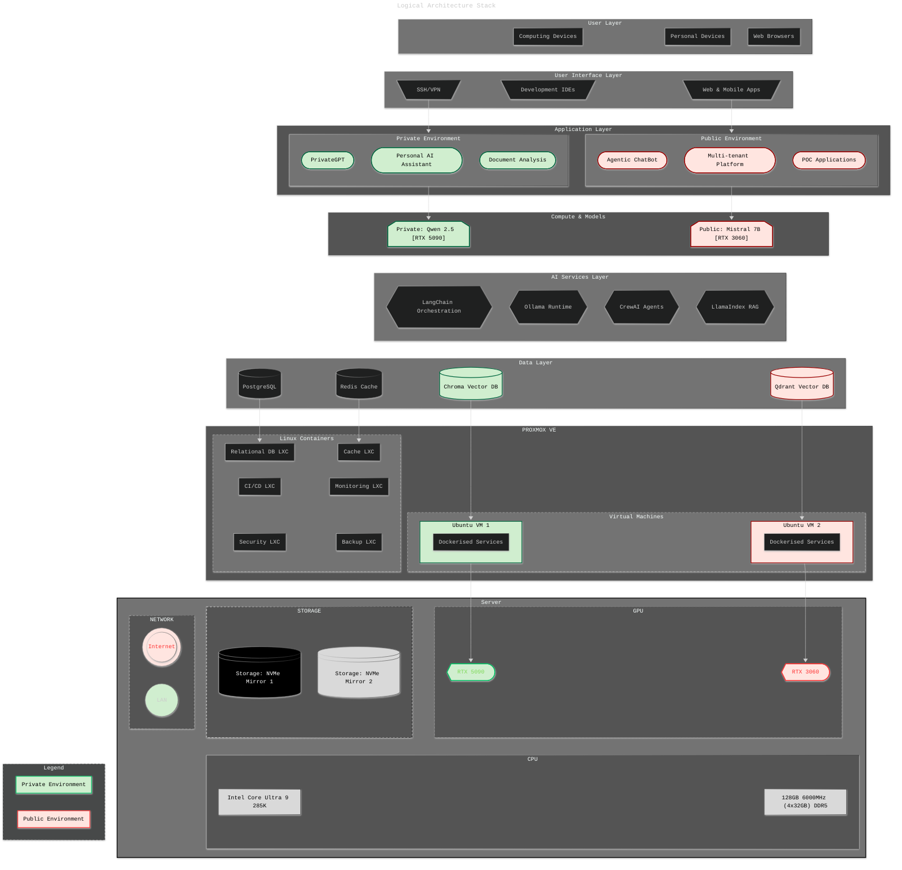

---

# ai-dualstack

**A 12-week AI Practitioner Playbook – from consumer to self-hosted solution**

> *From infrastructure to AI application development and RAG pipeline integration, modularised for week-by-week learning and future-proof skills development.*
>
> GOAL: Build, optimise, and master my own dual-AI system — a <kbd>private</kbd> “Second Brain” & <kbd>public</kbd> AI deployment — using Proxmox, GPU passthrough, Ollama, Qwen, Mistral, vector databases, and a robust dev stack.  
>  
 

## Table of Contents

- [Overview](#overview) 
- [Architecture](#architecture-stack)
- [Getting Started](#getting-started-ai-hardware-build)
- [Project Roadmap](#proposed-implementation-steps-milestones)
- [Contributing](#contributing)
- [License](#license)

---
 

## Overview
Project Goal: Stand up a highly optimised, secure, and extensible local AI platform for private knowledge management and public-facing applications.

---
 

## **Architecture Stack**
> Architecture highlights: GPU passthrough, RAG pipelines, full-stack monitoring, and modular security.

Logical Stack Diagram

   
    

> The full [Stack Breakdown](../../undefined) is also available as a table.

---
 

## Getting Started: AI Hardware Build
> A core part of the original decision maaking towards this project was to build a desktop AI system that remained under a $AUD 2400 budget whilst having a configuration that delivers good local AI capabilities \& performance (aiming at 50-70+ tokens/second) - all while maintaining complete data privacy and requiring minimal maintenance overhead. 
>
> The component choices therefore represent aiming to achieve the optimal balance of privacy, performance, scalability and operational simplicity. 
>
> All that said -- I also specced up a beefy AI Workstation. This comes in at a respectable $AUD 8600 ticket price. The question becomes - is that $AUDc 6K difference worth it? 
>
>Well, below are the specs, a couple of views around gauging perfoormance - and finally a [ROI comparison](../../undefined#roi-analysis). Make your own mind up from there.
 

BUILD COMPARISON

| Component                                                               | **Desktop AI Build**                                                                      | **Workstation AI Build**                                                                                         |
|-------------------------------------------------------------------------|-------------------------------------------------------------------------------------------|------------------------------------------------------------------------------------------------------------------|
| **[CPU](../../undefined#️-cpu-comparison)**           | Intel Core i5-14400F — Base 2.5GHz / Turbo 4.7GHz, 10C (6P+4E) / 16T, 65W (LGA1700)       | Intel Core **Ultra 9 285K** — Base ~3.2GHz / Turbo 5.7GHz, **24C (8P+16E) / 24T**, up to 250W (LGA1851), **NPU** |
| **CPU Cooler**                                                          | Thermalright **Peerless Assassin 140 Black** (dual-tower air)                             | Thermalright **Frozen Warframe 360** ARGB (360 mm AIO)                                                           |
| **Motherboard**                                                         | Gigabyte B760 Gaming AX / similar (DDR5, ATX, Wi-Fi 6, 2.5GbE)                            | ASUS **TUF Z890-Plus WiFi** (DDR5, **PCIe 5.0**, Wi-Fi 7 class, 2.5GbE)                                          |
| **Memory**                                                              | **128 GB DDR5-6000** (4×32 GB)                                                            | **128 GB DDR5-5600** (4×32 GB)                                                                                   |
| **[GPU](../../undefined#-gpu-comparison) (Primary)** | MSI GeForce **RTX 3060** Ventus 2X 12G OC — 12 GB GDDR6, PCIe 4.0, 3×DP 1.4a + 1×HDMI 2.1 | ZOTAC GAMING **RTX 5090 32 GB** — GDDR7, PCIe **5.0**, 3×DP 2.1a + 1×HDMI, advanced cooling                      |
| **GPU (Secondary)**                                                     | —                                                                                         | MSI GeForce **RTX 3060** Ventus 2X 12G OC — 12 GB GDDR6                                                          |
| **[Storage](../../undefined#-storage-comparison)**   | **2 TB NVMe** (2×1 TB PCIe 4.0)                                                           | **3 TB usable NVMe** ( (2×1 TB) RAID1 + (2×2 TB) RAID1, PCIe 4.0 )                                               |
| **Case**                                                                | Montech **AIR 1000 Premium** (mid-tower, airflow)                                         | **ASUS ProArt PA602** (E-ATX, creator-grade, high airflow)                                                       |
| **PSU**                                                                 | Cooler Master **MWE Gold V2 750 W** (80+ Gold)                                            | ASUS **ROG STRIX 1200G** (80+ Gold) / or 1200–1600 W class                                                       |
| **Fans / Extras**                                                       | 3x 140 mm high-flow case fans                                                             | 2x 200mm + 1x 140mm Case fans; Additional 3x 140 mm high-flow fans; anti-sag GPU bracket                         |
| **OS**                                                                  | Ubuntu/Proxmox                                                                            | **Proxmox VE** / Ubuntu for virtualised stacks                                                                   |

 

What those specs mean in real life

	
| Domain                  | What changes                          | Why it matters in your AI hub                                                                                                                                          |
|:------------------------|:--------------------------------------|:-----------------------------------------------------------------------------------------------------------------------------------------------------------------------|
| **Parallel pipelines**  | 24C/24T vs 10C/16T                    | **More concurrent workers**: faster doc ingestion, chunking, embedding, vector indexing, PDF parsing, OCR, ASR – all at once without starving the model server.        |
| **Latency under load**  | Bigger L2/L3 (40MB/36MB)              | **Lower cache misses** in token decode loops, JSON parsing, HTTP frameworks; steadier p95 latency when RAG + agents + API traffic hit together.                        |
| **Throughput ceilings** | Higher P-core turbo + sustained power | **Sustained boost** during long jobs (ingest, batch embedding, FAISS/ANN build); fewer “down-clocks” once the case warms up.                                           |
| **Virtualisation**      | More cores + bigger uncore            | **Hard isolation**: dedicate whole cores + a full GPU per VM (e.g., Proxmox). Private “Second Brain” can’t be impacted by public POC load.                             |
| **I/O bandwidth**       | Z890, PCIe **5.0**, more lanes        | **More NVMe at x4 each** and **GPU on Gen5** → fewer bus bottlenecks when you slam disk (Unstructured/LlamaParse) and serve models simultaneously.                     |
| **Media offload**       | iGPU (Quick Sync) present             | Free the 5090 for inference; use the iGPU for **transcodes/screen share/recording** in demos, or WebRTC gateways.                                                      |
| **On-CPU AI**           | **NPU** on Arrow Lake                 | Offload **small models** / filters via **OpenVINO** (e.g., TTS, OCR pre-/post-processing). Not a big LLM accelerator, but **frees CPU/GPU cycles** for the main graph. |
| **Storage topology**    | RAID1 + RAID1 (3 TB usable)           | **Redundancy** and **parallel reads**; safer for always-on quorums (Postgres/Qdrant) and faster cold-start reload of indices than a single 2 TB.                       |
| **Power headroom**      | 1200 W vs 750 W                       | **Fewer brownouts/throttles** when both GPUs and the CPU surge; leaves room for future drives or a higher-TDP GPU.                                                     |

 

AI Performance comparison

| Metric                       | Desktop AI                   | Workstation AI                       | What you feel day-to-day                                                   |
|:-----------------------------|:-----------------------------|:-------------------------------------|:---------------------------------------------------------------------------|
| **Max viable model**         | ~30B quantised (tight)       | **70B+** quantised / mixed-precision | Bigger models and/or larger batch sizes without juggling VRAM.             |
| **RAG QPS (steady)**         | Moderate (single-tenant)     | **High**, survives load spikes       | Public POC traffic won’t tank your private assistant.                      |
| **Batch embedding**          | Minutes for large corpora    | **2–4× faster** end-to-end           | Cores + cache + PCIe keep workers fed; less tail latency.                  |
| **Agent graphs**             | Occasional stalls under load | **Smooth concurrency**               | Orchestrators (LangChain/LangGraph/CrewAI) keep parallel tools responsive. |
| **Virtual machines**         | Not recommended for GPU      | **Yes**: one GPU per VM              | Clean dev/prod separation, easier demos.                                   |
| **Media/ASR/TTS side-tasks** | Eats CPU/GPU budget          | **iGPU/NPU offload**                 | Keeps the main LLM hot path snappy.                                        |
| **Resilience**               | Single disk set              | **Mirrored sets**                    | Safe rebuilds, faster index reloads.                                       |
| **Thermals / acoustics**     | Air, OK under load           | **360 mm AIO + big chassis**         | Sustained boost clocks with lower noise.                                   |

 

> **Begin at [`/docs/host-setup.md`](/docs/host-setup.md)** for the physical-to-virtualisation platform configurations.

---
 

## Proposed Implementation Steps & Milestones
> Oh, yes, this is subject to change. I'm following a few interesting projects at the moment that may strongly influence me to incorporate their findings. I will record and track these changes when and if they occur.

Proposed Milestone Journey

| Step | Focus Area                                      | Key Outcome/Deliverable                             |
|------|-------------------------------------------------|-----------------------------------------------------|
| 1    | Host Setup, BIOS, Proxmox VE Install            | Secure, accessible Proxmox VE host                  |
| 2    | RAID/LVM Storage, Network, Access Config        | Storage pools, static IP, remote admin              |
| 3    | GPU Passthrough Enablement (BIOS \+ Host)       | IOMMU/VT-d validated, RTX 3060 isolated             |
| 4    | Proxmox VM/LXC Creation, Topology Tuning        | Private AI VM and Public AI LXC in place            |
| 5    | CPU/Memory/NUMA/IO Tuning                       | Optimized resource configs, hugepages, pinning      |
| 6    | Private AI Stack (Ollama \+ Qwen \+ Qdrant)     | Private AI VM serving LLM via WebUI, private vector |
| 7    | Public AI Stack (Ollama \+ Mistral \+ ChromaDB) | Public AI LXC serving LLM, ChromaDB API functional  |
| 8    | Docker Compose, Networking                      | Compose workflows, isolated/bridged subnets         |
| 9    | Monitoring: Prometheus, Grafana, Alerting       | Dashboards and health alerts for all infra          |
| 10   | Backup, Recovery, Automation                    | Automated backup scripts, disaster recovery tested  |
| 11   | RAG Pipeline, Dev Container, Jupyter            | Document chunking, dev tools, JupyterLab online     |
| 12   | Security Review, Benchmark, Final Tuning        | Firewall finalization, performance, handover docs   |

 

> I'll use `/docs/milestone-checklist.md` to track my progress.

---
 

## Contributing

Contributions and suggestions are welcome — please use Issues/Discussions for suggestions, requests and Q&A. I don't percieve that you will want to, but you are of course welcome to fork or submit pull requests as well.

---
 

## License

This repository is licensed under the **GNU General Public License v3.0**. See [LICENSE](LICENSE) for details.

---
 

*Happy building! For questions, feedback, or to share your own extensions, open a Discussion or contact the repo owner.*

---

