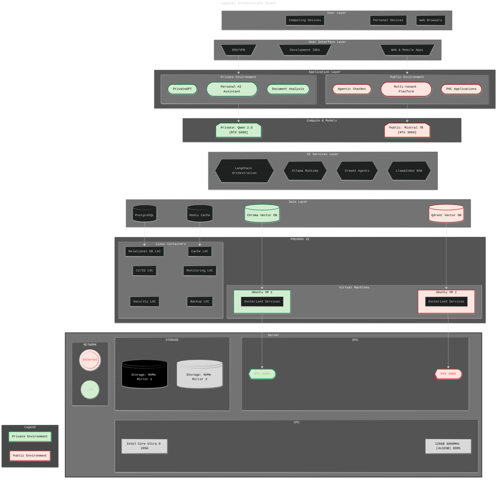

# Architecture Stack

## **AI Hub Technology Stack**

| Function Category | Common Use Cases | Open Source Tools & Frameworks | AI Hub Choice | Reasoning | Priority |
|---|---|---|---|---|---|
| Platform & Infrastructure | Virtual environments, container orchestration, resource management | Proxmox, Docker, Kubernetes, LXC | Proxmox VE (Hypervisor) Docker Compose (Container orchestration) | Perfect for dual-environment isolation with dedicated GPU allocation | Tier 1 |
| Base Models | Text generation, multimodal AI, specialised tasks | Llama 3.2, Qwen 2.5, Mistral, Gemma, Whisper, LLaVA | Qwen 2.5 14B/32B (Private reasoning) Mistral 7B (Public lightweight) | Qwen offers better multilingual + reasoning; Mistral for efficient public serving | Tier 1 |
| Model Deployment | Serving LLMs, API endpoints, model lifecycle | Ollama, vLLM, TensorRT-LLM, TorchServe | Ollama (Primary runtime) vLLM (High-performance inference) | Ollama for simplicity; vLLM for production-grade performance when needed | Tier 1 |
| Database Layer | Structured data, user sessions, audit logs, caching | PostgreSQL, MySQL, Redis, MongoDB | PostgreSQL (Relational data) Redis (Cache + sessions) | PostgreSQL for multi-tenant data; Redis for performance and session management | Tier 1 |
| Model Management | Prompt engineering, workflow orchestration, model ops | LangChain, LangFlow, Semantic Kernel | LangChain (Core orchestration) LangFlow (Visual prototyping) | LangChain for enterprise skills; LangFlow for rapid experimentation | Tier 1 |
| Vector Databases | Semantic search, embeddings storage, similarity matching | Chroma, Qdrant, Weaviate, Milvus | Chroma (Private environment) Qdrant (Public environment) | Chroma for simplicity; Qdrant for production features and metadata filtering | Tier 1 |
| Security & Secrets | API keys, certificates, secrets management | Vault, Bitwarden, SOPS, Age | Vault (Secrets management) OAuth2/JWT (API security) | Vault for enterprise-grade secrets; OAuth2 for API protection | Tier 1 |
| Backup & Recovery | Data protection, disaster recovery, snapshots | Restic, Borg, Duplicity, Proxmox Backup | Restic (Incremental backups) Proxmox Backup Server (VM snapshots) | Restic for file-level protection; Proxmox for infrastructure snapshots | Tier 1 |
| Web Frameworks | APIs, UIs, rapid prototyping | FastAPI, Streamlit, Gradio, Django | FastAPI (Production APIs) Streamlit (Rapid prototyping) | FastAPI for robust APIs; Streamlit for quick demo interfaces | Tier 1 |
| RAG Engines | Retrieval-augmented generation, document Q&A | LlamaIndex, Haystack, LangChain RAG | LlamaIndex (Document-centric RAG) LangChain RAG (Complex pipelines) | LlamaIndex excels at document ingestion; LangChain for advanced orchestration | Tier 2 |
| Document Processing | OCR, PDF parsing, data extraction | Unstructured.io, LlamaParse, PyPDF2, Tesseract | Unstructured.io (Primary) LlamaParse (LlamaIndex integration) | Unstructured.io for comprehensive processing; LlamaParse for better LLM integration | Tier 2 |
| Message Queue | Background tasks, async processing, job queues | Redis/Celery, RabbitMQ, Apache Kafka | Redis + Celery (Async tasks) | Essential for async AI processing and background model operations | Tier 2 |
| LLM Frameworks | Fine-tuning, prompt engineering, model training | HuggingFace Transformers, Unsloth, LoRA | HuggingFace Transformers (Core) Unsloth (Efficient fine-tuning) | HF for ecosystem compatibility; Unsloth for resource-efficient training | Tier 2 |
| Model Evaluation | Performance tracking, drift detection, debugging | Langfuse, Phoenix (Arize), RAGAS, TruLens | Langfuse (LLM observability) RAGAS (RAG evaluation) | Langfuse for comprehensive tracking; RAGAS for RAG-specific metrics | Tier 2 |
| Monitoring & Observability | System monitoring, logging, alerting | Prometheus, Grafana, ELK Stack, Loki | Prometheus + Grafana (Metrics) Grafana + Loki + Promtail (Logging) | Unified monitoring stack with AI-specific observability | Tier 2 |
| Development Environment | IDEs, code assistance, debugging | VS Code, Cursor, Windsurf, JupyterLab | Cursor (AI-enhanced coding) JupyterLab (Experimentation) | Cursor for AI-assisted development; Jupyter for interactive analysis | Tier 2 |
| CI/CD & Config | Version control, automation, deployment | GitLab, Gitea, Jenkins, Ansible | Gitea (Git hosting) Ansible (Configuration management) | Gitea for lightweight self-hosted Git; Ansible for infrastructure automation | Tier 2 |
| Data Platforms | ETL, workflow automation, data orchestration | Apache Airflow, Prefect, dbt, DuckDB | DuckDB (Analytics) Prefect (Workflow orchestration) | DuckDB for local analytics; Prefect for modern data workflows | Tier 2 |
| Authentication & Identity | Multi-tenant auth, user management, SSO | Keycloak, Auth0, OAuth2, LDAP | Keycloak (Open source IAM) OAuth2/OIDC (Modern protocols) | Keycloak for enterprise-grade auth with modern protocol support | Tier 2 |
| AI Agent Frameworks | Multi-step reasoning, autonomous workflows | CrewAI, AutoGen, LangGraph, OpenAI Swarm | CrewAI (Multi-agent orchestration) LangGraph (Complex workflows) | CrewAI for team-based agents; LangGraph for precise workflow control | Tier 3 |
| Graph Knowledge Bases | Relationship mapping, knowledge graphs, memory | Neo4j, GraphRAG, NetworkX, Zep | Neo4j Community (Graph database) Zep (Conversational memory) | Neo4j for complex relationships; Zep for session management | Tier 3 |
| Storage & File Management | Object storage, file sync, cloud integration | MinIO, Rclone, AWS S3, Tresorit | MinIO (S3-compatible storage) Rclone (Cloud sync) | MinIO for local object storage; Rclone for secure cloud integration | Tier 3 |
| SSL & Certificate Management | Automated SSL, certificate lifecycle | Cert-Manager, Let's Encrypt, ACME | Cert-Manager + Let's Encrypt | Automated SSL management for production deployments | Tier 3 |
---
 

Logical Stack Diagram

   
    
